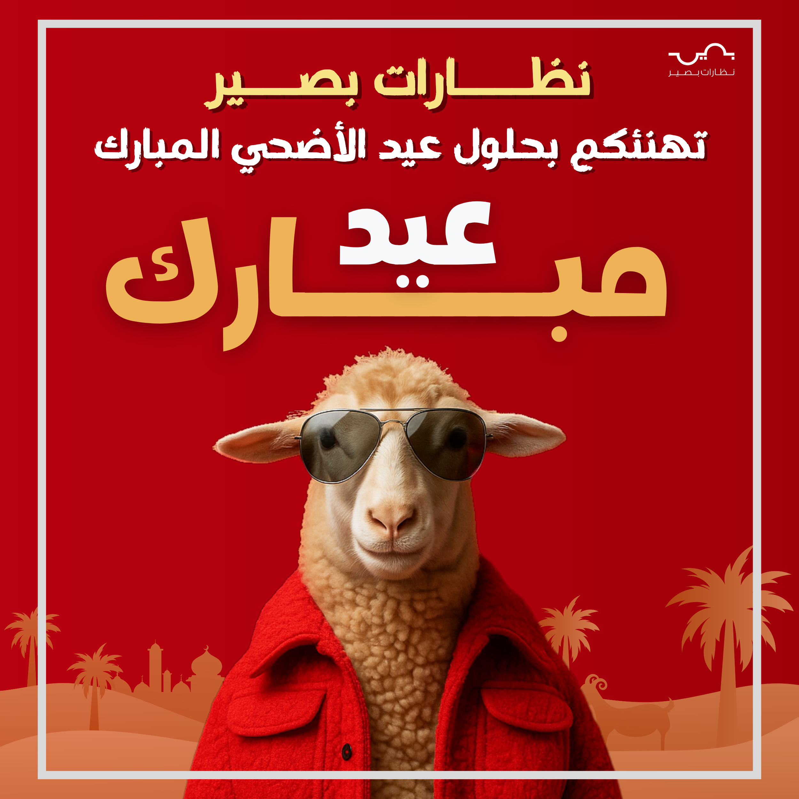

# 🎨 Creative Graphic Design Portfolio

A showcase of commercial graphic design work, focusing on **Brand Identity**, **Social Media Marketing**, and **Visual Communication**. This repository highlights my ability to combine creativity with business goals.

---

## 👓 Case Study: Eyewear Store Branding
**Role:** Graphic Designer | **Tools Used:** Canva & Design Principles

This project involved creating a cohesive visual identity for a local Eyewear Store. The goal was to reflect **elegance, clarity, and modern style** through social media posts and promotional banners.

### 🌟 Design Showcase
Here are samples of the marketing materials and social media designs:

  
  
  

 

  
  
  

---

## 🎯 Scope of Work
* **Social Media Campaigns:** Designed engaging posts to showcase new eyewear collections.
* **Promotional Banners:** Created high-conversion visuals for seasonal offers and discounts.
* **Visual Consistency:** Maintained a unified color palette and typography to strengthen brand recognition.

## 🛠️ Skills Demonstrated
* **Visual Hierarchy:** Arranging elements to guide the viewer's eye.
* **Color Theory:** Selecting colors that evoke trust and sophistication.
* **Typography:** Choosing fonts that are readable and aligned with the brand's voice.
* **Marketing Design:** Creating visuals driven by sales and engagement goals.

---

